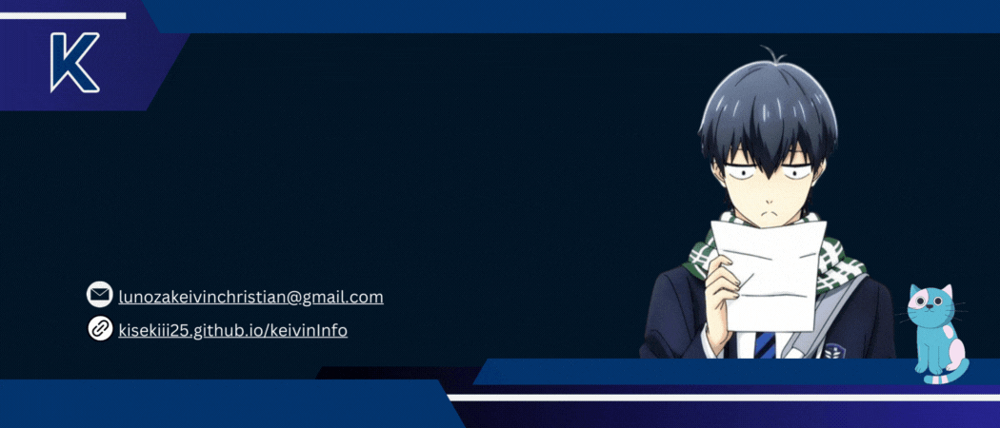

<h3 align="left">PROFILE VISITORS :</h3>

###

  

###

<h3 align="left">SOCIALS :</h3>

###

  
  
  
  

###

<h3 align="left">TECHNOLOGY STACK :</h3>

###

  
  
  
  
  
  
  
  
  
  
  

###

<h3 align="left">STATS :</h3>

###

  
  

###

<h3 align="left">MY SPOTIFY :</h3>

###

 

###

  

###

###
